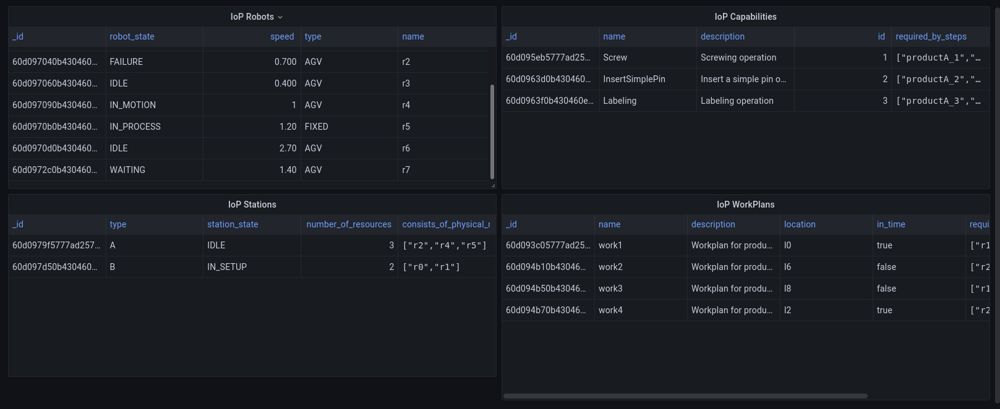

# Short story

* This repo describes how to set the mongoDB connection to grafana dashboard application.

* The connection between grafana and mongoDB is given by the **use a plugin**. **The use the oficial mongoDB plugin** (https://grafana.com/grafana/plugins/grafana-mongodb-datasource/) it is possible but it is necessary to acquire a **Enterprise license**. 

* There is a workaround which is to use a nodejs server to redirect the Grafana's requests to mongoDB and vice-versa.

* That implementation is exposed in the git https://github.com/JamesOsgood/mongodb-grafana

* The instructions below guide the user trough a process to configure that plugin

* After the configuration the use of grafana becomes easier


# System Configuration

## Grafana configuration

1. Install grafana for your system. https://grafana.com/docs/grafana/latest/installation/debian/

1. Find the grafana configuration file (e.g. /etc/grafana/grafana.ini). To find the configuration file follow recommendations at https://grafana.com/docs/grafana/latest/administration/configuration/

1. On the found file, check the path where grafana scans for plugins. https://grafana.com/docs/grafana/latest/administration/configuration/#plugins (e.g. for linux is the /var/lib/grafana/plugins)

1. Pull the repo https://github.com/JamesOsgood/mongodb-grafana

1. Copy and paste the whole repo into to the folder where grafana scans for plugins (e.g. for linux is the /var/lib/grafana/plugins)

1. Execute a "npm install" in the folder. If you face some problem with the npm installation and ros-melodic follow this https://answers.ros.org/question/329144/installing-ros-melodic-ros-base-deletes-npm-installing-npm-deletes-ros-how-can-i-have-both/ 

1. Execute the server "npm run server". This plugin acts like a bridge bwtween mongodb and grafana server. The server listen to grafana requests in port 3333 and parses to the mongodb. The server should be running all the time during the operation

1. Allow the unsigned plugin to run. https://grafana.com/docs/grafana/latest/plugins/plugin-signatures/. 
-   On the configuration file (/etc/grafana/grafana.ini) Replace the line ";allow_loading_unsigned_plugins" by "allow_loading_unsigned_plugins =grafana-mongodb-datasource"

1. If grafana is running, restart grafana. 
-       sudo service grafana-server restart

## Grafana. Only if you have the  Enterprise license it works

1. Create persistent storage for grafana. 
-       docker volume create grafana-storage

2. Run grafana with mongo-db plugin 
-       docker run -d -p 3000:3000 -e "GF_INSTALL_PLUGINS=grafana-mongodb-datasource" -v grafana-storage:/var/lib/grafana grafana/grafana

3. Configure Mongo DB connection

4. Create dashboards and queries

## Mongo DB configuration

1. Install Mongo DB for your system. https://docs.mongodb.com/manual/tutorial/install-mongodb-on-ubuntu/


# PoC Execution


## Grafana

## Create mongo db connection

1. In Grafana (localhost:3000) Go to add data source. Configuration -> Data sources

2. Go to Data sources tab

3. Click on Add data source

4. Select MongoDB plugin 

5. Configure plugin
-   On HTTP:
-       URL = http://localhost:3333
-   In Auth:
        Depends on your mongodb security configuration
-   In MongoDB Details
-       MongoDB URL: mongodb://localhost:27017
-       MongoDB Database: INTERNET_OF_PRODUCTION


6. The correct configuraiton for the plugin is shown in:
One correctly setting for a query is show in:

    
7. Import the dashboard DemoTestDashboard.json located at src/demo folder.
-       Create -> Import
-       Select "Upload JSON file"
-       Select DemoTestDashboard.json
-       Give a name and select a folder for the dashboard installation
-       Click import


8. When working the panel should look like: 



## Mongo DB

## Mongo DB configuration

1. Navigate to src/demo/MongoDB

1. Execute
-       mongorestore --host localhost --port 27017 --db INTERNET_OF_PRODUCTION dump/INTERNET_OF_PRODUCTION

1. The database now is configured to answer to Grafana requests


When correctly uploaded the mongoDB should look like:


## Extra

1. Create the panels and add mongo db queries, Folow instructions to build queries here https://github.com/JamesOsgood/mongodb-grafana.
-       Only aggregate queries supported
        e.g.= db.system_log.aggregate
                ([{
                "$match": {"time" : "19-0-45"}}
                ])
        e.g. = db.work_plans.aggregate
                ([{
                "$match": {}}
                ])

One correctly setting for a query is show in:


## Loading Grafana dashboards

1. In the folder ```dashboards``` you can find the dashboards in .json format
2. Hover the mouse over the + sign and select ```import```
3. Click in ```Upload JSON file```
4. Check the name and UID code if necessary
5. Click ```import```

